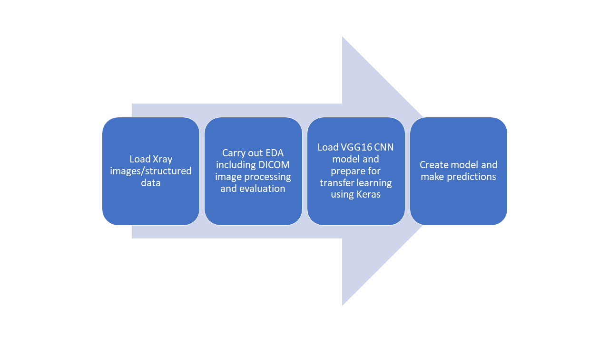
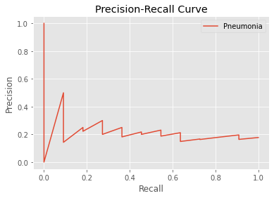
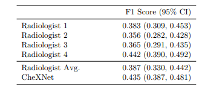

# FDA  Submission

**Your Name: Sarangan Ravichandran **

**Name of your Device: Pneumonia Detection From Chest X-Rays Classifier**

## Algorithm Description 

### 1. General Information

**Intended Use Statement:** The software (algorithm) is used for assisting the radiologist in the detection of Pneumonia from X-Ray images.  

**Indications for Use:** Screening X-Ray images for patients between the ages of 20-70 years old. The algorithm is not tested for patients with previous history of Pneumonia.

**Device Limitations:** Computational Limitation: Access to modern CPU/GPU system with enough disk space (each model will take anywhere between several hundreds of MB to few GBs).

**Clinical Impact of Performance:** 

### 2. Algorithm Design and Function



**DICOM Checking Steps:**
We have created a function the does the following things: 
* Read the dicom file 
* Checks the following important fields  of the dicom file:
    * Modality
    * PatientID
    * Body Part Examined
    * Patient Age
    * Patient Position (AP/PA or PA/AP)
    * Photmetric Interpretation
* Image file will be scaled and normalized 


**Preprocessing Steps:**
We carry out the following steps: 
* Standardize the image
* resize the image

**CNN Architecture:**
I used the VGG16 CNN architecture (see below) for transfer learning. The architecture of VGG16 is shown below:
```
Model: "model_1"
_________________________________________________________________
Layer (type)                 Output Shape              Param #   
=================================================================
input_1 (InputLayer)         (None, 224, 224, 3)       0         
_________________________________________________________________
block1_conv1 (Conv2D)        (None, 224, 224, 64)      1792      
_________________________________________________________________
block1_conv2 (Conv2D)        (None, 224, 224, 64)      36928     
_________________________________________________________________
block1_pool (MaxPooling2D)   (None, 112, 112, 64)      0         
_________________________________________________________________
block2_conv1 (Conv2D)        (None, 112, 112, 128)     73856     
_________________________________________________________________
block2_conv2 (Conv2D)        (None, 112, 112, 128)     147584    
_________________________________________________________________
block2_pool (MaxPooling2D)   (None, 56, 56, 128)       0         
_________________________________________________________________
block3_conv1 (Conv2D)        (None, 56, 56, 256)       295168    
_________________________________________________________________
block3_conv2 (Conv2D)        (None, 56, 56, 256)       590080    
_________________________________________________________________
block3_conv3 (Conv2D)        (None, 56, 56, 256)       590080    
_________________________________________________________________
block3_pool (MaxPooling2D)   (None, 28, 28, 256)       0         
_________________________________________________________________
block4_conv1 (Conv2D)        (None, 28, 28, 512)       1180160   
_________________________________________________________________
block4_conv2 (Conv2D)        (None, 28, 28, 512)       2359808   
_________________________________________________________________
block4_conv3 (Conv2D)        (None, 28, 28, 512)       2359808   
_________________________________________________________________
block4_pool (MaxPooling2D)   (None, 14, 14, 512)       0         
_________________________________________________________________
block5_conv1 (Conv2D)        (None, 14, 14, 512)       2359808   
_________________________________________________________________
block5_conv2 (Conv2D)        (None, 14, 14, 512)       2359808   
_________________________________________________________________
block5_conv3 (Conv2D)        (None, 14, 14, 512)       2359808   
_________________________________________________________________
block5_pool (MaxPooling2D)   (None, 7, 7, 512)         0         
=================================================================
Total params: 14,714,688
Trainable params: 14,714,688
Non-trainable params: 0
```
I froze all but the last convolution layer (block5; see below) 
```
input_1 False
block1_conv1 False
block1_conv2 False
block1_pool False
block2_conv1 False
block2_conv2 False
block2_pool False
block3_conv1 False
block3_conv2 False
block3_conv3 False
block3_pool False
block4_conv1 False
block4_conv2 False
block4_conv3 False
block4_pool False
block5_conv1 False
block5_conv2 False
block5_conv3 True
block5_pool True
```
Built a new CNN model on top of the VGG16 model. Note the input layer will reflect the correct dimension of X-Ray image input. We add a few dropout and dense layers (starting from flatten_1) and end with a sigmoid output layer. Here is the final model architecture. Note the layers after `model_1` are the newly added layers.  

```
Model: "sequential_1"
_________________________________________________________________
Layer (type)                 Output Shape              Param #   
=================================================================
model_1 (Model)              (None, 7, 7, 512)         14714688  
_________________________________________________________________
flatten_1 (Flatten)          (None, 25088)             0         
_________________________________________________________________
dropout_1 (Dropout)          (None, 25088)             0         
_________________________________________________________________
dense_1 (Dense)              (None, 1024)              25691136  
_________________________________________________________________
dropout_2 (Dropout)          (None, 1024)              0         
_________________________________________________________________
dense_2 (Dense)              (None, 512)               524800    
_________________________________________________________________
dropout_3 (Dropout)          (None, 512)               0         
_________________________________________________________________
dense_3 (Dense)              (None, 256)               131328    
_________________________________________________________________
dropout_4 (Dropout)          (None, 256)               0         
_________________________________________________________________
dense_4 (Dense)              (None, 1)                 257       
=================================================================
Total params: 41,062,209
Trainable params: 28,707,329
Non-trainable params: 12,354,880
```

### 3. Algorithm Training

**Parameters:**
* Types of augmentation used during training: 
    * horizontal_flip = True
    * vertical_flip = False (not appropriate for X-Ray images)
    * height_sift_range = 0.1
    * width_shift_range = 0.1
    * rotation_range = 20 
    * shear_range = 0.1
    * zoom_range = 0.1 
* Batch size was set to 64
* Optimizer learning rate: lr = 1e-05
* Layers of pre-existing architecture that were frozen: Block1-Block5_conv2. Note in the following output block, `False` indicates non-trainable or frozen layers
    ```
    input_1 False
    block1_conv1 False
    block1_conv2 False
    block1_pool False
    block2_conv1 False
    block2_conv2 False
    block2_pool False
    block3_conv1 False
    block3_conv2 False
    block3_conv3 False
    block3_pool False
    block4_conv1 False
    block4_conv2 False
    block4_conv3 False
    block4_pool False
    block5_conv1 False
    block5_conv2 False
    block5_conv3 True
    block5_pool True
    ```
* Layers of pre-existing architecture that were fine-tuned
   ``` 
   block5_conv3 
   block5_pool
   ```
* Layers added to pre-existing architecture
    ``` 
    Flatten
    Dropout(0.05)
    Dense(1024, activation='relu')
    Dropout(0.1)
    Dense(512, activation='relu')
    Dropout(0.2)
    Dense(256, activation='relu')
    Dropout(0.3)
    Dense(1, activation='sigmoid')
    ```
* algorithm training performance visualization 



**Final Threshold and Explanation:**

### 4. Databases

The database contains 112,120 X-Ray images. The number of Pneumonia Positive images is only 1431 (1431 out of 110689). This is a highly imbalanced dataset (pneumonia positive: 1.29% and 98.71% negative cases). For modeling, we need to create a dataset (training set) for creating models and a datasset (validation set) for evaluating the models. Note that some projects will create three datasets training, validation and test datasets. For this project, we will stick with training and validation datasets.   

**Description of Training Dataset:** 

Training set is created by the following procedure: 

* The original dataset is split into 80% training and the remaining as validation dataset 
* The 80% original dataset is further balanced for positive and negative cases. 
* The final training set has a dimension of 2290 (Pneumonia class or positive class = 1145 and negative or non-pneumonia class = 1145). Please see the "Build and train model.ipynb" for details.

**Description of Validation Dataset:** 

The 20% original data is further balanced based on the prevalence of Pneumonia (1:4). The final validation dataset has the following dimensions, pneumonia class: 1144 and negative class: 286. Please see the "Build and train model.ipynb" for details.


### 5. Ground Truth

Ground truth labels were generated from the associated radiological reports using natural language processing (NLP). Please refer to the following publications for details, . Authors indicate that the results are almost 90% accurate. 


### 6. FDA Validation Plan

**Patient Population Description for FDA Validation Dataset:**
* Gender (Male/Female) population distribution is between 1 and 100. The distribution is biased slightly towards the Male (Female: 0.44, Male: 0.56; ratio Male/Female ~= 1.27).
* The data included comorbidities such as, Atelectasis, Consolidation, Cardiomegaly,
  Edema, Infiltration, Mass, Nodule, Pleural_Thickening, Pneumonia, Pneumothorax
* X-Ray Dicom image file included many properties including,
   - Type: Dx
   - Body Part Examined: CHEST, RIBCAGE etc. 
   - Patient Age
   - Patient Position: AP, PA 
   - Prediction:  "Not pneumonia" or "Pneumonia" 
   - Modality: 1, 2, etc. 
   (plesae refer inference.ipynb for details)

**Ground Truth Acquisition Methodology:**
 Some of the commonly used ground truths are: 
 * Biopsy (tim-consuming and difficult to obtain) 
 * NLP-extracted labels based on radiology reports 
 
It is tempting to use NLP-extracted labels based on radiology report as the ground truth. But, in the deep learning paper published by Rajpurkar et al, https://arxiv.org/pdf/1711.05225.pdf, CheXNet model F1 Score seems to be doing better than the average Radiologist (4 of them) F1 score (0.435 vs 0.387; Table 1 from the above mentioned paper).

**Algorithm Performance Standard:**
. This accuracy comparison table was obtained from the paper, https://arxiv.org/pdf/1711.05225.pdf. For a model to out perform the CheXNet model, the F1-score should be greater than 0.435. 